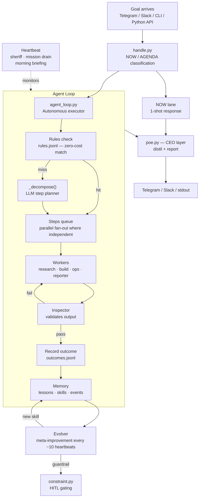

# Poe Orchestration

Autonomous agent framework. Give it a goal; it decomposes, executes, learns, and reports. No hand-holding required.

Works standalone or alongside OpenClaw, Telegram, Slack, or any other interface you wire in.

---

## What it does

- **Autonomous loops**: goal → plan → execute steps → done|stuck, with stuck detection, roadblock recovery, and progress logging
- **Multi-agent delegation**: Director plans, Workers execute (research / build / ops), Inspector validates — no Worker grades its own output
- **Persistent memory**: lessons extracted from every run, injected into future prompts; tiered decay (short/medium/long); spaced repetition
- **Self-improvement**: meta-evolver reviews failure patterns every 10 minutes and proposes prompt/guardrail/skill changes
- **Skill library**: reusable step patterns extracted from successful runs; scored, tested, and promoted automatically
- **Interface-agnostic**: Telegram, Slack, CLI, or call `run_agent_loop()` directly from Python — same behavior regardless of how a goal arrives
- **Token-efficient research**: pre-fetch layer intercepts URLs before LLM calls, uses Jina Reader for clean markdown, authenticated X/Twitter access via CLI

---

## Architecture



### LLM backends (`llm.py`)

All share one interface: `LLMAdapter.complete(messages, tools) → LLMResponse`

| Backend | When active |
|---------|-------------|
| `AnthropicSDKAdapter` | `ANTHROPIC_API_KEY` set |
| `ClaudeSubprocessAdapter` | `claude` binary in PATH (Claude Code OAuth) |
| `OpenRouterAdapter` | `OPENROUTER_API_KEY` set |
| `OpenAIAdapter` | `OPENAI_API_KEY` set |
| `CodexCLIAdapter` | `codex` binary available (ChatGPT OAuth) |

`build_adapter("auto")` selects the best available backend. `MODEL_CHEAP/MID/POWER` abstract model names across backends.

---

## Quickstart

```bash
# Install (creates editable install with test + runtime deps)
pip install -e ".[dev]"

# Bootstrap workspace + services
python3 src/cli.py poe-bootstrap install

# Run an autonomous research loop
python3 src/agent_loop.py "research winning polymarket strategies"

# Route a message (auto-classifies NOW vs AGENDA)
python3 src/cli.py poe-handle "what time is it in Tokyo?"
python3 src/cli.py poe-handle "build me a research summary on LLM orchestration"

# Start Telegram listener
python3 src/telegram_listener.py           # run forever
python3 src/telegram_listener.py --once    # process pending and exit

# System health
python3 src/cli.py sheriff health
python3 src/cli.py poe-observe

# Memory
python3 src/cli.py memory context
python3 src/cli.py poe-memory status
```

No OpenClaw installation required. Set `POE_WORKSPACE` to any directory and run.

### Logging

Structured logging via stdlib `logging`. All loggers live under the `poe.*` namespace.

```bash
# Quiet (default) — only warnings and errors
python3 src/agent_loop.py "your goal"

# Step lifecycle, timing, tokens, block reasons
POE_LOG_LEVEL=INFO python3 src/agent_loop.py "your goal"

# Full detail — constraint checks, adapter type, content lengths
POE_LOG_LEVEL=DEBUG python3 src/agent_loop.py "your goal"
```

The `--verbose` CLI flag is equivalent to `POE_LOG_LEVEL=DEBUG`. Output goes to stderr so it doesn't interfere with result output.

| Logger | What it covers |
|--------|---------------|
| `poe.loop` | Step start/done/blocked, adapter timing, loop lifecycle |
| `poe.persona` | Persona spawn, adapter resolution, spawn completion |

---

## Interfaces

### Telegram

Deploy `deploy/poe-telegram.service` to listen 24/7:

```bash
sudo cp deploy/poe-telegram.service /etc/systemd/system/
sudo systemctl enable --now poe-telegram
```

Slash commands:

| Command | What it does |
|---------|-------------|
| `/status` | System health, heartbeat, stuck projects |
| `/research <goal or URL>` | Autonomous research loop with live step progress |
| `/director <directive>` | Full Director/Worker pipeline |
| `/build <goal>` | Build worker |
| `/ops <command>` | Ops worker |
| `/map` | Goal relationship map |
| `/ancestry <project>` | Goal ancestry chain |
| `/stop` | Stop running loop |
| `/help` | Command list |

Natural language is auto-routed (NOW = fast, AGENDA = multi-step loop). Messages during an active loop are routed as interrupts.

### Slack

Mirror of the Telegram interface using Socket Mode (no public endpoint):

```bash
pip install slack-sdk
export SLACK_BOT_TOKEN=xoxb-... SLACK_APP_TOKEN=xapp-...
python3 src/slack_listener.py
```

### Python API

```python
from agent_loop import run_agent_loop

result = run_agent_loop(
    "research the three main benefits of prediction markets",
    project="polymarket-research",
    step_callback=lambda n, text, summary, status: print(f"step {n}: {summary}"),
)
print(result.summary())
```

---

## Always-on services

```bash
# Heartbeat (health + meta-evolver, 60s interval)
sudo cp deploy/poe-heartbeat.service /etc/systemd/system/
sudo systemctl enable --now poe-heartbeat

# Inspector (quality validation, runs every 20 heartbeat ticks)
sudo cp deploy/poe-inspector.service /etc/systemd/system/
sudo systemctl enable --now poe-inspector
```

Heartbeat recovery tiers:
1. **Scripted**: disk warn, API key missing, gateway down → log suggestion
2. **LLM diagnosis**: stuck projects → cheap LLM recovery action
3. **Telegram escalation**: critical health → alert Jeremy

---

## Configuration

Credentials are read in priority order:
1. Environment variables: `ANTHROPIC_API_KEY`, `OPENROUTER_API_KEY`, `OPENAI_API_KEY`, `TELEGRAM_BOT_TOKEN`
2. `$POE_ENV_FILE` or `<workspace>/secrets/.env`
3. `~/.openclaw/openclaw.json` (OpenClaw config, if present)

Workspace root resolves as: `POE_WORKSPACE` → `OPENCLAW_WORKSPACE` → `WORKSPACE_ROOT` → `~/.poe/workspace`

OpenClaw is fully optional. The system runs standalone on any machine with Python 3.10+ and a Claude/OpenAI API key.

---

## Source modules

| Module | What it does |
|--------|-------------|
| `agent_loop.py` | Autonomous loop: decompose goal → execute steps → done\|stuck |
| `llm.py` | Platform-agnostic LLM adapters (Anthropic, OpenRouter, OpenAI, subprocess, Codex) |
| `web_fetch.py` | URL pre-fetch: Jina Reader clean markdown, X/Twitter auth, t.co resolution |
| `memory.py` | Outcome recording, lesson extraction, tiered decay, Reflexion injection |
| `skills.py` | Reusable step patterns: extract, score, test-gate, promote |
| `persona.py` | Composable agent identities (researcher, builder, ops, companion, psyche-researcher) |
| `hooks.py` | Pluggable callbacks at step/loop/mission level |
| `poe.py` | CEO layer: distill active missions → executive summary |
| `handle.py` | Entry point: classify intent → route → execute → respond |
| `telegram_listener.py` | Telegram polling, slash commands, ack+edit UX, live step progress |
| `slack_listener.py` | Slack Socket Mode, mirrors Telegram commands |
| `director.py` | Director: plan → delegate to workers → review output |
| `workers.py` | Worker agents: research, build, ops, general |
| `sheriff.py` | Loop Sheriff: detect stuck loops, system health checks |
| `heartbeat.py` | Periodic health + tiered recovery + Telegram escalation |
| `evolver.py` | Meta-evolver: analyze outcomes → propose improvements |
| `inspector.py` | Quality agent: friction detection, alignment scoring, evolver feed |
| `mission.py` | Mission hierarchy: Mission → Milestone → Feature → Worker Session |
| `ancestry.py` | Goal ancestry chain: parent_id, ancestry.json, prompt injection |
| `metrics.py` | Success rate, cost, token usage per task type; pass@k / pass^k |
| `constraint.py` | Pre-execution action validator: 5 pattern groups (destructive/secret/path/network/exec), HIGH blocks, MEDIUM warns, pluggable registry |
| `security.py` | Prompt injection detection on external content (pre-loop scanning) |
| `config.py` | Workspace resolution, credential discovery, env var priority |
| `bootstrap.py` | `poe-bootstrap install`: dirs, services, smoke test |
| `orch.py` | Core file-first state: NEXT.md tasks, run records, project lifecycle |

---

## Memory and self-improvement

```
Run completes
    → memory.py records outcome + extracts 1-3 lessons
    → tiered JSONL: short (session) / medium (weeks) / long (months)
    → decay applied daily; lessons promoted on score + reuse threshold

Every 10 heartbeat ticks (~10 min):
    → evolver analyzes last 50 outcomes
    → identifies failure patterns
    → generates suggestions: prompt_tweak | new_guardrail | skill_pattern

Next run with similar task:
    → inject_tiered_lessons() loads relevant lessons (long-tier first)
    → ancestry context loaded
    → both injected into decompose + execute prompts
    → router.py picks skills by predicted success probability (not just keyword match)
    → TF-IDF fallback when router not trained — relevance-ranked, not just keyword substring
```

---

## Safety and reliability

**Constraint harness** (`constraint.py`) — fires before every step execution, no LLM round-trip required:
- Blocks destructive patterns (`rm -rf`, `DROP TABLE`, `format /`)
- Blocks secret exposure (`/etc/passwd`, `~/.ssh/`, env dumps)
- Blocks path escape (writes outside workspace)
- Warns on unsafe network ops and shell exec patterns

**Skill circuit breaker** — distinguishes a network blip from a broken skill:
- 1-2 failures → circuit stays CLOSED, no action (blip tolerance)
- 3+ consecutive failures → circuit OPEN → skill queued for LLM rewrite
- After rewrite → HALF_OPEN (probationary, needs 2 successes to close)
- Failure during HALF_OPEN → immediately back to OPEN

**Prompt injection detection** (`security.py`) — scans external content before it enters the agent context.

---

## Development

```bash
# Run tests (1460+ passing, all LLM calls mocked)
python3 -m pytest tests/ -q

# Dry-run (no LLM calls)
python3 src/agent_loop.py "test goal" --dry-run --verbose
python3 src/cli.py poe-heartbeat --dry-run
python3 src/cli.py poe-eval --dry-run
```

---

## Compatibility

- **OpenClaw**: reads `~/.openclaw/openclaw.json` for credentials/tokens; can coordinate via OpenClaw gateway (`src/gateway.py`)
- **Telegram**: first-class interface via Bot API polling
- **Slack**: Socket Mode, no public endpoint needed
- **macOS + Linux**: `bootstrap.py` generates systemd (Linux) or launchd (macOS) service files
- **Docker**: `Dockerfile` + `docker-compose.yml` for isolated deployment
