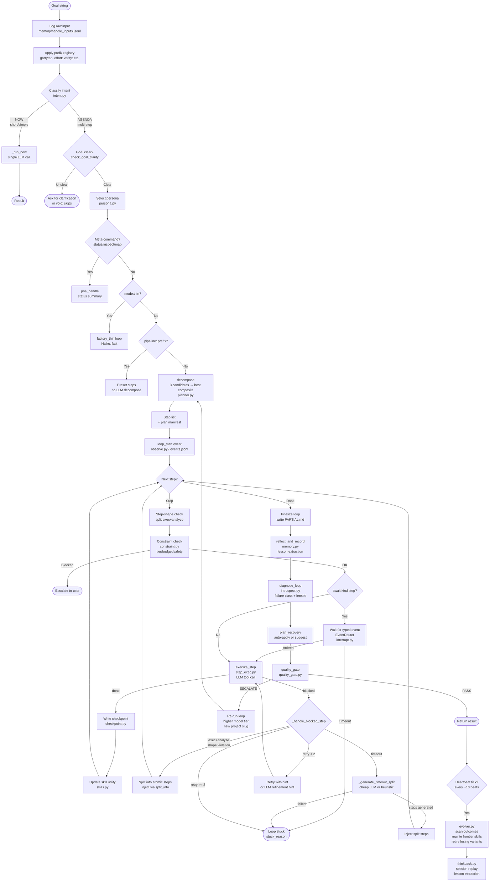

# Poe Execution Flow

End-to-end diagram of how a goal moves through the system. Useful for spotting
where quality degrades, where costs concentrate, and where self-correction fires.



---

## Where things go wrong (hallucination / quality map)

```
DECOMPOSE ← 3 LLM calls, multi-plan composition. Variance here = different step granularity.
             Garrytan bundled 3 large files in step 1 → timeout. Blind split them → fine.

STEP_EXEC ← Each step accumulates completed_context. By step 6-8, context is large.
             Large context → higher confabulation risk in synthesis steps.
             completed_context compression fires after step 5 (keeps last 3 full).

FINALIZE  ← synthesis step reads ALL prior step summaries. This is where hallucinations
             appear: file names, test counts, module status confabulated from partial memory.
             Mitigation: file-existence verification pass (not yet implemented).

QG        ← Quality gate catches output-level issues ("this is a summary, not a review")
             but does NOT fact-check specific claims against the filesystem.
             Cross-ref pass (cross_ref.py) could do this but isn't wired into self-review.
```

---

## Cost concentration (from 2026-04-06 blind run, 8 steps, $4.12 total)

| Step | Cost | What happened |
|------|------|---------------|
| 1 | $0.22 | Read 4 docs |
| 2 | $0.50 | Read core modules (handle/intent/director/workers) |
| 3 | $1.09 | Read quality+meta layer (5 large modules) ← expensive |
| 4 | $0.53 | Read I/O+infra layer |
| 5 | $0.33 | Run pytest |
| 6 | $0.77 | Read test results artifact ← expensive (225s) |
| 7 | $0.52 | Cross-check CHANGELOG vs code |
| 8 | $0.16 | Synthesis |

Step 3 and 6 dominate. Step 3 is inherently large (memory.py + evolver.py are huge).
Step 6 surprises — reading a test results text file shouldn't cost $0.77; likely the
accumulated context from steps 1-5 is making each subsequent step more expensive.

---

## Patterns worth revisiting

1. **Context snowball**: each step appends to completed_context; by step 6+ the model is
   carrying ~1M tokens of prior work. Compression helps but synthesis is still expensive.
   Consider: separate synthesis loop with only step summaries, not full results.

2. **Planner variance on step granularity**: the same goal gives wildly different step
   sizes depending on which 3-plan composite wins. Garrytan bundled files that blind split.
   A step-size budget hint in the decompose prompt ("each step should complete in <60s")
   could stabilize this.

3. **Hallucination enters at synthesis**: reading steps (1-7) produced accurate summaries
   (step log lines were correct). Hallucinations appeared in the final synthesis (step 8)
   and in the first-pass result that the quality gate rejected. Suggests: run a
   file-existence verification pass immediately before synthesis.

4. **Quality gate fires correctly but expensively**: escalation adds a full second 8-step
   pass. A cheaper first-check (haiku pass over step summaries only) might catch bad
   first-pass outputs without running the whole loop again.

5. **Self-review bias**: the system reviewing itself may be structurally forgiving on
   judgment calls while being sloppy on verifiable facts. Cross-ref pass is designed
   for this but isn't wired into the adversarial review path.
