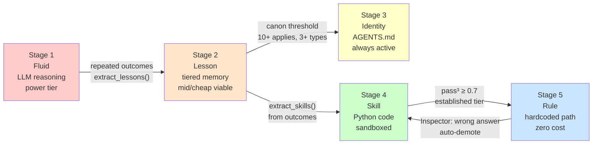

# Knowledge Crystallization

*Design note — Jeremy Stone, March 2026. Captures the "sapling to tree" concept for Poe's long-term learning architecture.*

---

## The Core Idea

A decision that starts as open-ended LLM reasoning should, over time, harden into a cheaper, faster, more reliable form — if the pattern proves stable. This is analogous to how expertise works: a novice reasons about every choice; an expert has internalized so many patterns that most choices are immediate, and only genuinely novel situations require full deliberation.

Poe should work the same way. The question is: **how do we make that graduation path explicit and testable?**

---

## The Crystallization Path



```
Stage 1: Fluid
    LLM reasoning on every decision
    High cost, high flexibility, high error rate
    Model tier: power (full deliberation)

Stage 2: Lesson (tiered memory)
    Pattern extracted from repeated outcomes
    Stored as medium → long tier TieredLesson
    Injected into future prompts (still LLM, but guided)
    Model tier: mid or cheap viable for guided cases

Stage 3: Identity (canon → AGENTS.md)
    Lesson crosses canon threshold (10+ applications, 3+ task types)
    Human-gated promotion to system prompt identity
    "Always approach X as..." — no longer requires explicit retrieval
    Applied zero-cost (part of every call)

Stage 4: Skill (Python code)
    Pattern is deterministic enough to express as code
    `extract_skills(outcomes)` identifies candidates
    Sandboxed Python execution (Phase 18 hardened)
    Testable, composable, version-controlled
    Model tier: not needed for known patterns

Stage 5: Rule (established skill → hardcoded path)
    Skill crosses established threshold (pass^3 ≥ 0.7)
    Pattern is so reliable it no longer needs LLM involvement at all
    Could be: a data lookup, a shell script, a conditional branch
    Zero inference cost for that class of decision
```

### The graduation tax

Each stage reduces both cost and flexibility:

| Stage | Per-decision cost | Flexibility | Failure mode |
|-------|------------------|-------------|--------------|
| Fluid | ~$0.005–0.05/call | Maximum | Inconsistent, expensive |
| Lesson | ~$0.002–0.02/call | High | Noisy injection |
| Identity | ~$0.001/call (amortized) | Medium | Overfitting persona |
| Skill | Microseconds | Low | Wrong pattern match |
| Rule | Nanoseconds | Minimal | Brittle edge cases |

The system should never force graduation — it surfaces candidates and Jeremy (or the Inspector) decides when hardening is appropriate.

---

## What We Have Today

The infrastructure exists through Stage 4:

- **Tiered memory** (Phase 16): medium → long decay/promote, canon tracking
- **Canon candidates** (Phase 16): `get_canon_candidates()` surfaces lessons ready for Stage 3
- **Skill extraction** (Phase 10): `extract_skills(outcomes)` → `memory/skills.jsonl`
- **Skill tiers** (Phase 16): `provisional` → `established` via `promote_skill_tier()`
- **Sandbox** (Phase 18): hardened execution for Stage 4 skills

What's **missing**:

1. **Stage 5 graduation path**: no mechanism for an established skill to graduate into a hardcoded conditional or data rule. Currently skills are always executed via sandbox subprocess even when they're deterministic.

2. **Model tier optimization**: no automatic detection of "this task type consistently succeeds at mid/cheap tier — stop using power." The persona system has `model_tier` but it's set statically at persona creation.

3. **Cross-stage visibility**: no unified view of "what's at each crystallization stage right now" — you'd have to check tiered memory, skills.jsonl, and AGENTS.md separately.

---

## The Gardener Role

Jeremy is the gardener. The system surfaces candidates; the gardener decides what gets pruned or promoted.

**Current gardener tools:**
- `poe-memory canon-candidates` — Stage 2→3 review queue
- `poe-evolver --list` / `--apply` — evolver suggestions
- `poe-skills list` + `poe-skill-stats` — Stage 4 health
- `poe-memory promote` — manual Stage 2 promotion

**What the gardener doesn't have yet:**
- A unified "crystallization dashboard" — all graduation candidates in one view. `poe-knowledge status` (Phase 22 first cut) pulls from `canon_stats.jsonl` + `skills.jsonl` + evolver suggestions into a single display.
- A way to say "this skill is now a rule" and have the system skip the sandbox entirely. Simplest first cut: a `rules/` directory of tiny Python modules imported directly (no subprocess, no sandbox). Inspector watches for "rule produced wrong answer" and auto-demotes to Stage 4.
- Cost/benefit signal: "this skill runs 50x/day, promoting to rule saves $X/month"

---

## Design Questions for Future Work

1. **Stage 5 representation**: What does a "rule" actually look like in code? Options:
   - A Python function in a `rules/` directory, called directly without sandbox
   - An entry in `memory/rules.jsonl` (pattern → output mapping)
   - A compiled dispatch table in `skills.py`
   - A simple if/elif chain in `handle.py` for the most common paths

2. **Model tier auto-optimization**: Should the evolver track per-task-type success rates by model tier and suggest downgrades? (Yes — this is a natural evolver extension, see `metrics.py`.)

3. **Anti-pattern: premature crystallization**: A skill that gets promoted to a rule but is actually context-dependent will produce wrong answers silently. Need confidence bounds and the Inspector to watch for "rule produced wrong answer" signals.

4. **The young shoots**: New capabilities should always enter at Stage 1 (fluid). The gardener's job is partly to prevent premature hardening that kills plasticity in growing areas.

---

## Relationship to Existing Phases

| Phase | Crystallization role |
|-------|---------------------|
| Phase 5 (flat memory) | Pre-tiering: lessons extracted but not graduated |
| Phase 10 (skills) | Stage 4 entry: deterministic skills emerge from outcomes |
| Phase 14 (attribution) | Failure attribution informs what should NOT graduate |
| Phase 16 (tiered memory) | Formal Stage 2→3 path; canon candidates; skill tiers |
| Phase 18 (sandbox) | Stage 4 hardening: skills executed safely |
| Future (Phase 22?) | Stage 5: established skills → rules; model tier auto-opt |

---

## North Star

The goal isn't to replace LLM reasoning everywhere — it's to ensure that **LLM reasoning is reserved for genuinely novel situations**. Every time Poe uses a power-tier model to answer a question it's answered correctly 50 times before, that's waste. The crystallization path turns waste into infrastructure.

*"A young sapling is flexible and has a bunch of shoots. As it grows it gets more hardened and fixed, changing to become the foundation of other young shoots to continue growing. The gardener prunes and trims to make sure trees are trees, bushes stay bushes, and we get fruit properly instead of shade as appropriate."*
— Jeremy, March 2026
